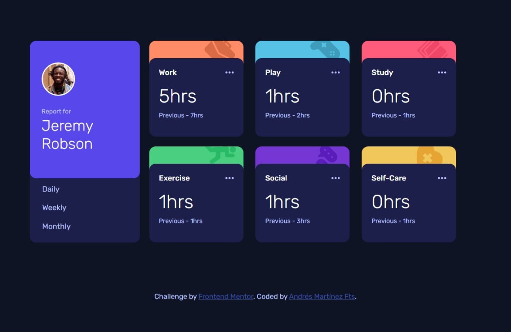

# Frontend Mentor - Time tracking dashboard solution

This is a solution to the [Time tracking dashboard challenge on Frontend Mentor](https://www.frontendmentor.io/challenges/time-tracking-dashboard-UIQ7167Jw). Frontend Mentor challenges help you improve your coding skills by building realistic projects.

## Table of contents

- [Overview](#overview)
  - [The challenge](#the-challenge)
  - [Screenshot](#screenshot)
  - [Links](#links)  
- [My process](#my-process)
  - [Built with](#built-with)
  - [What I learned](#what-i-learned)
  - [Useful resources](#useful-resources)
- [Author](#author)

## Overview

### The challenge

Users should be able to:

- View the optimal layout for the site depending on their device's screen size
- See hover states for all interactive elements on the page
- Switch between viewing Daily, Weekly, and Monthly stats

### Screenshot

Desktop Preview



Mobile Preview


The preview of my solution.

### Links

- Live Solution URL: [Time Tracking](https://time-tracking-dashboard-andresmtzf.vercel.app/)

## My process

### Built with

- Semantic HTML5 markup
- CSS custom properties
- Flexbox
- CSS Grid
- Mobile-first workflow
- JavaScript
- BEM (Block, Element, Modifier)

### What I learned

For this solution I reaffirmed my abilities of HTML y CSS.
For first time I used the methodology BEM, to write a CSS.
With the nomenclature I could  have a CSS file easily to read, understand and scalable. In addition, BEM helps to organize CSS classes in independent modules.
In this case, even though this is a short exercise, is useful to avoid CSS nest.

I take this solution to put in

To see how you can add code snippets, see below:

```html
<div class="card">
        <div class="card__background">
                    
        </div>
</div>        
```

```css
.card {
  ...
}
.card__background {
  ...
}
.card__image{
  ...
}
```

### Useful resources

- [CodingTube](https://www.youtube.com/c/CodingTube) - This helped me for understand how could separate in blocks the elements of the dashboard. I really liked his way to explain.

## Author

- Frontend Mentor - [@AndresMtzF](https://www.frontendmentor.io/profile/AndresMtzF)

**Happy Coding**🤖
